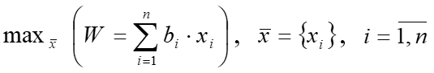
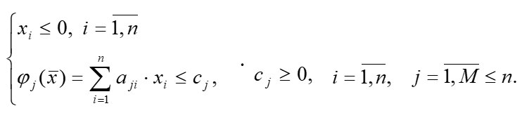

# EvolutionOfParameter

Программа для решения задач линейного программирования методом эволюции параметра. Реализовано на HTML+CSS+JS.

Возможности:
- Решение задач с большим количеством переменных >50
- Вывод подробного решения
- Два способа ввода данных - вручную через форму и загрузка из файла
- Решение нескольких задач (только в режиме загрузки данных из файла)

Вывод подробного решения рекомендуется отключать при решении больших задач или их большого количества, для ускорения процесса вычислений (т.к. сам процесс вывода подробного решения занимает, как правило, значительно больше времени, чем сами расчеты).

Поддерживается решение задач, приведенных к следующему виду:

  Целевая функция:
  
  Ограничения:
  

